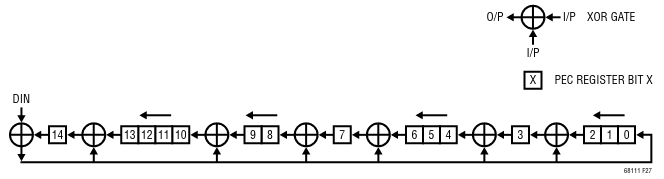

# Packet Error Code

The **Packet Error Code** (abbreviated as *PEC*) is a 15-bit [CRC](https://it.wikipedia.org/wiki/Cyclic_redundancy_check)
value calculated on an arbitrary amount of bits in the order in which they are passed.

The initial value of the PEC is `0x16` and it uses the following *polynomial*:

$$x^{15} + x^{14} + x^{10} + x^{8} + x^{7} + x^{4} + x^{3} + 1$$

The PEC is sent to the LTC6811 in the following format:

| NAME |   BIT 7 |   BIT 6 |   BIT 5 |   BIT 4 |   BIT 3 |  BIT 2 |  BIT 1 |  BIT 0 |
| ---- | ------- | ------- | ------- | ------- | ------- | ------ | ------ | ------ |
| PEC0 | PEC[14] | PEC[13] | PEC[12] | PEC[11] | PEC[10] | PEC[9] | PEC[8] | PEC[7] |
| PEC1 |  PEC[6] |  PEC[5] |  PEC[4] |  PEC[3] |  PEC[2] | PEC[1] | PEC[0] |      0 |

---

When data is sent or received the PEC is calculated, by the receiver, from the given data
and it is compared with the received PEC; if they match the data is considered valid and
it is kept, otherwise all the data is discarded.

!!! note
    There is no mechanism for data recorvery so, in case of PEC error, the sent or received message
    should be re-sent until it is received correctly (if possible)

Below a picture of the PEC calculation circuit is shown:

