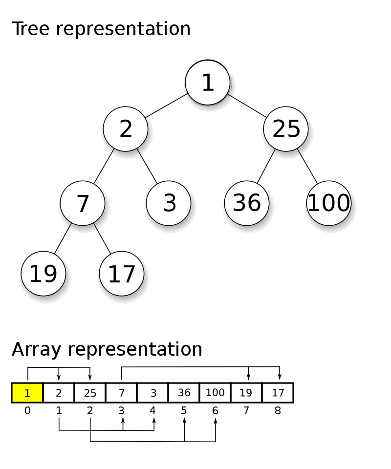

# Min heap

A [minimum heap](https://en.wikipedia.org/wiki/Heap_(data_structure)) is a **tree-based** data structure
that satisfies the *minimum heap properties*:

1. The root element is always the minimum of all the items in the heap
2. For each item in the heap its parent has a value which is always lower or equal than the item's value

The heap is often implemented using a fixed size array

