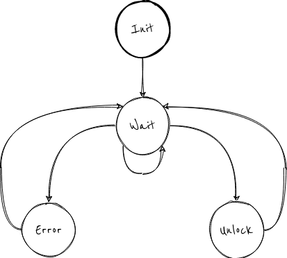

# Turnstiles

This example implements a basic state machine that describes the functioning of a smartcard-operated turnstile.

It's reccomended to keep the fsm code in a separate file (`fsm_turnstile.c` in this example).

We have five states:

1. **Init**: that initializes the peripherals and variables
2. **Idle**: that waits for a smartcard and checks its validity.
3. **Unlock**: that unlocks the turnstile for a limited amount of time.
4. **Wait Lock**: that locks the turnstile after a set delay.
5. **Error**: that writes an error message on the display.

In `main.c` we only include `fsm_turnstile.c`.

To initialize the FSM, one just needs to fill `state_table` with the functions relative to each state and pass it to the `fsm_init()` function.
